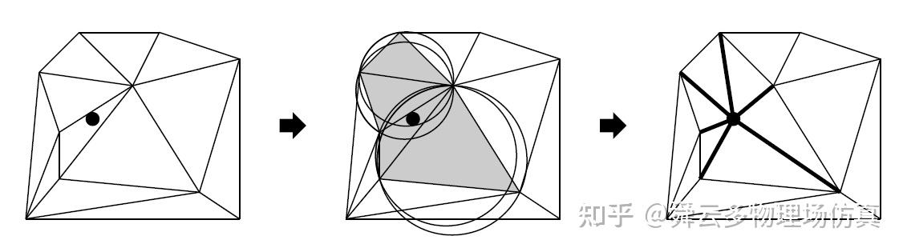

# delaunay
## 三角剖分(triangulation)

是对给定的平面点集生成三角形集合的过程。  
对于给定的点集 P={ P1 ,..., Pn} ,存在三角形集合 T = { T1 ,..., Tm}
满足： 
1. 所有三角形的端点恰好构成集合P
2. 任意两个三角形的边不相交（要么重合，要么没有交点）
3. 所有三角形的合集构成P的凸包

同一点集的三角剖分的结果并不唯一，一般不希望三角形过于狭长，接近等边三角形会比较好，对于三角剖分的质量往往从以下几个方面进行评价：
1. 最小角 ：三角形内角中最小的角
2. 纵横比 : 三角形最短边和最长边的比例
3. 半径比 ：三角形内接圆半径和外接圆半径的比例 

## delaunay 三角剖分
delaunay三角剖分是所有外接圆均满足空圆性质的三角剖分
- 空圆性质：三角形的外接圆内(不包括边界)不包含除这个三角形以外的任何顶点。

## delaunay 三角剖分的方法
### lawson 方法
 - (a) 先计算点集P的包围盒(bounding box)，将包围盒的四个顶点加入 P 中得到 P’ 。根据包围盒生成两个超三角形(super triangles)，构成初始三角剖分T0。由于只包含两个直角三角形， T0是（包围盒四个顶点的）一个Delaunay三角剖分。
 - (b) 将点集中的顶点逐步加入到 P’ 中,与现有的三角剖分 T0 做以下操作：  
    找到插入顶点Pi所在的三角形，将三角形t 以Pi分裂成三个新三角形t0,t1,t2  
    对每个新生成的三角形做空圆检测，对不满足空圆性质的进行边翻转，直到没有坏边。
 - (c)  当所有顶点都按照(b)步骤加入了P'，删除一开始包围盒的4个顶点，并删除与其相连接的三角形信息，得到了关于P点集的delaunay三角剖分T
### bowyer-watson 方法
-  (a)同lawson方法的(a)
-  (b) 对于新加入的顶点Pi, 找到所有外接圆包含其的三角形集合，将其删除形成一个洞，将洞的边界与点Pi相连接形成新的三角形。
-  (c) 同lawson方法的(c) 

图1.三角剖分方法的示意图
 

图2.bowyer-watson 的b步骤示意图
 
