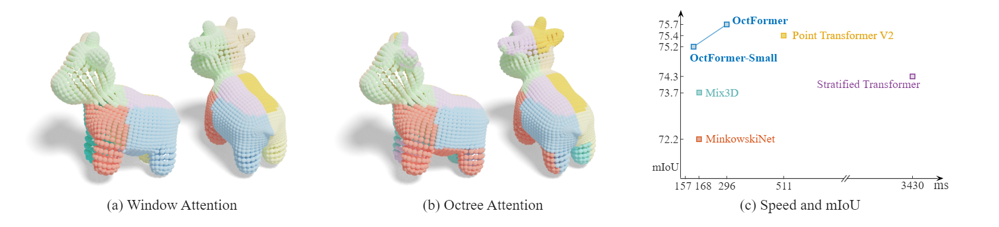
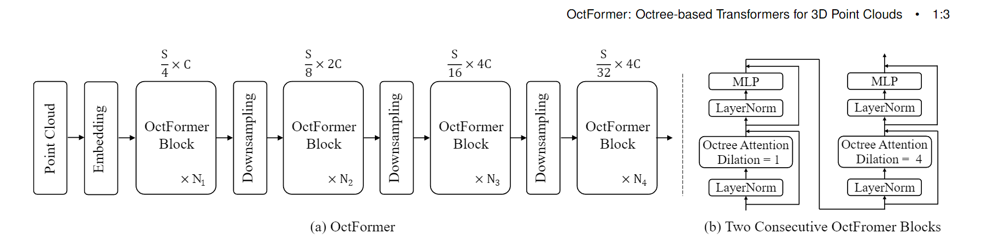

# OctFormer
<center style="font-size:14px;color:#C0C0C0;text-decoration:underline">图1.octree不规则窗体和规则窗体的对比</center> 
```
图(a) 传统的用规则的窗体划分点云 图(b) 用八叉树划分点云保证每个划分的窗体点数一致  图(c) 纵坐标 准确率 横坐标 250k points的点云在3090上进行一次前向计算所需时间
```


作者发现注意力机制对于底层窗体的形状并不敏感，所以将以前的包含不规则点数的规则立方体窗体替换成了包含规则点数的不规则立方体窗体  
这一步是为了GPU友好的并发  
第二个发现是当采用Oct-tree 对点云进行并行划分后，如果采用Z-order的顺序去对八叉树节点进行排序可以使那些在空间上接近的节点在内存上也是连续存储的。  
这一步可以方便训练Local的Feature和加快训练的速度  

<center style="font-size:14px;color:#C0C0C0;text-decoration:underline">图2.octformer的网络架构</center> 
Embeding层作者提到了一些tricks，用一系列小步长和小卷积核的卷积层去代替传统的大核大步长的卷积层，这样对transformer的训练更稳定。

<center style="font-size:14px;color:#C0C0C0;text-decoration:underline">图3.窗体读取顺序</center> 
缺陷：
- 小规模数据集上容易过拟合
- 缺少交叉注意力机制
- 在3d内容生成上缺乏建树

## 代码解读
```python
class OctFormerSeg(torch.nn.Module):

    def __init__(
        self, in_channels: int, out_channels: int,  #in_channels 输入特征通道数 out_channels 输出特征通道数  
        channels: List[int] = [96, 192, 384, 384],
        num_blocks: List[int] = [2, 2, 18, 2],
        num_heads: List[int] = [6, 12, 24, 24],
        patch_size: int = 32, dilation: int = 4, drop_path: float = 0.5, 
        #patch_size 一个block 所包含的点云数 
        #dialation 滑动数隔多少个点取一个窗体 参考图3 目的是为了窗体之间有信息交互获得全局的特征
        #drop_path 随机丢失一部分权重，防止过拟合
        nempty: bool = True, stem_down: int = 2, head_up: int = 2,
        #stem_down 下采样率 head_up 
        pn_channel: int = 168, head_drop: List[float] = [0.0, 0.0], **kwargs):
    super().__init__()
    self.backbone = OctFormer(
        in_channels, channels, num_blocks, num_heads, patch_size, dilation,
        drop_path, nempty, stem_down)
    self.head = SegHeader(
        out_channels, channels, fpn_channel, nempty, head_up, head_drop)
    self.apply(self.init_weights)

    def init_weights(self, m):
    if isinstance(m, torch.nn.Linear):
      torch.nn.init.trunc_normal_(m.weight, std=0.02)
      if isinstance(m, torch.nn.Linear) and m.bias is not None:
        torch.nn.init.constant_(m.bias, 0)

    def forward(self, data: torch.Tensor, octree: Octree, depth: int,
              query_pts: torch.Tensor):
    features = self.backbone(data, octree, depth)
    output = self.head(features, octree, query_pts)
    return output
```